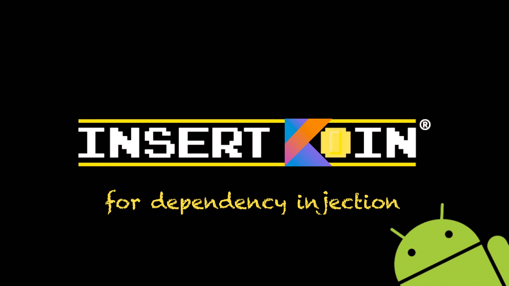

# Insert Koin to make dependency injection

KOIN is a dependency injection framework that uses Kotlin and its functional power to get things done!  No proxy/CGLib, No code generation, No introspection. Just functional Kotlin and DSL magic ;)



## Setup

Check that you have `jcenter` repository. Add the following gradle dependency to your Android app:

```gradle
compile 'org.koin:koin-android:0.3.0'
```

## Getting Started

First of all, you need to write a module. A module **gathers your components definitions** and allows it to be loaded by Koin and injected in your application. Keep in mind, that **injection by constructor** is the default strategy targeted by Koin. In Android components (Activity, Fragment ...) you can use `by inject()` to inject your dependencies.  

### Declare your dependencies

First of all, write a module class (extends [AndroidModule](https://github.com/Ekito/koin/wiki#module-class)), overrides the `context()` function by using the `declareContext` function, to declare a context like below:

```Kotlin
class MyModule : AndroidModule() {
    override fun context() =
            declareContext {
                provide { ServiceA(get()) }
                provide { ServiceB() }
                provide { ServiceC(get(), get()) }
            }
}

//for classes
class ServiceA(val serviceB: ServiceB) 
class ServiceB()
class ServiceC(val serviceA: ServiceA, val serviceB: ServiceB)
```

### Koin DSL

To describe your module, you can use the following **Koin DSL** keywords:

* `provide { /* component definition */ }` declares a component for your [Module](https://github.com/Ekito/koin/wiki#module-class) - You provide a function to instanciate your component
* `bind {/* compatible type */}` [bind](https://github.com/Ekito/koin/wiki#type-binding) a compatible type for *provided definition* (use it behind provide{} expression)
* `get()` resolve a component dependency
* `scope {/* scope class */}` use the given [scope](https://github.com/Ekito/koin/wiki#scopes) for current module's definitions


### Setup your Application

To start your module, you must build it in your *application* class like below:

```Kotlin
class MainApplication : Application(), KoinContextAware {

     /**
     * Koin context
     */
    lateinit var koinContext: KoinContext

    /**
     * KoinContextAware - Retrieve Koin Context
     */
    override fun getKoin(): KoinContext = koinContext

    override fun onCreate() {
        super.onCreate()
        // insert Koin !
        koinContext = Koin().init(this).build(MyModule()) 
        // ...
    }
}
```

Implement `KoinContextAware` interface, and make your *koinContext*. This will able you to use the **Koin Android extensions** in your Android Application.

**Don't forget to use the** `init()` function to init *Android context* injection, else you won't be able to load your modules & extensions.


### Inject your components

Once your app is configured and ready to go, you have to ways of handling injection in your application:

* Android components (Activity,Fragment...): use the by inject() lazy operator
* Kotlin componenst: injection is made by constructor

Below a quick sample of using `by inject()` in an Activity:

```Kotlin
class MainActivity : AppCompatActivity() {

    // inject my WeatherService 
    val weatherService by inject<WeatherService>()
    // ...
}
```


### Complete Tutorial with the demo-app

Check the [*demo-app*](https://github.com/Ekito/koin/tree/master/koin-android/demo-app) source code and get a more complete application. The [demo-app wiki page](https://github.com/Ekito/koin/wiki/Demo-App) describes all about Koin in a real app.


## Documentation

Check the [wiki](https://github.com/Ekito/koin/wiki) for complete documentation.

## Articles

* [Insert Koin for dependency injection](https://www.ekito.fr/people/insert-koin-for-dependency-injection/)
* [Better dependency injection for Android](https://proandroiddev.com/better-dependency-injection-for-android-567b93353ad)

## Contact & Support

Check the [kotlin slack](https://kotlinlang.org/community/) - `#koin channel

